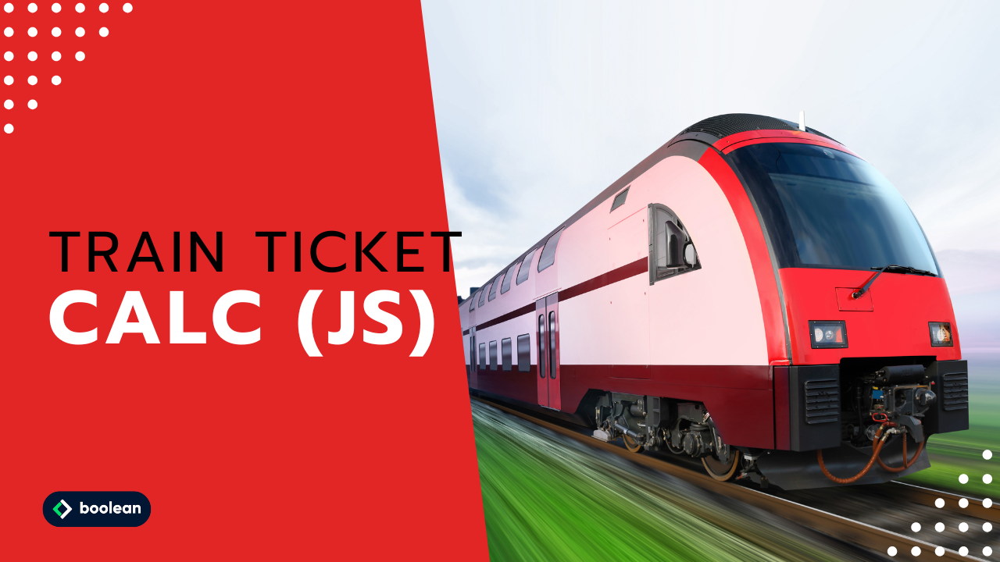

 
Ventiquattresimo Esercizio Classe #137 - Boolean

---

Studente: Fabio Ferrero

---
# English

## Target of the project:
Write a program that asks the user:
- The number of miles to be traveled
- The age of the passenger

Based on this information he/she should calculate the total price of the travel ticket, according to the following rules:
- the ticket price is defined on the basis of kilometers (0.21 € per km)
- a 20% discount is to be applied for minors
- a 40% discount is to be applied for the over-65s.

---
# Italiano

## Obiettivo del progetto:
Scrivere un programma che chieda all’utente:
- Il numero di chilometri da percorrere
- Età del passeggero

Sulla base di queste informazioni dovrà calcolare il prezzo totale del biglietto di viaggio, secondo le seguenti regole:
- il prezzo del biglietto è definito in base ai km (0.21 € al km)
- va applicato uno sconto del 20% per i minorenni
- va applicato uno sconto del 40% per gli over 65.
---

